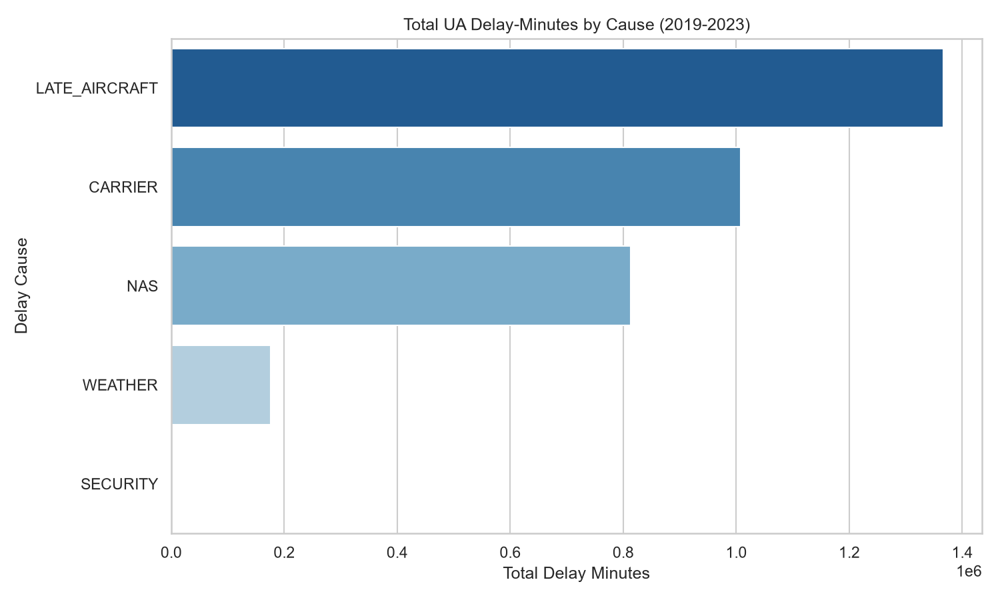
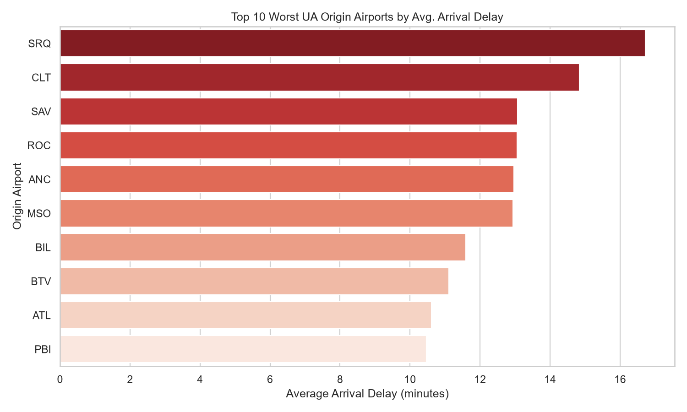
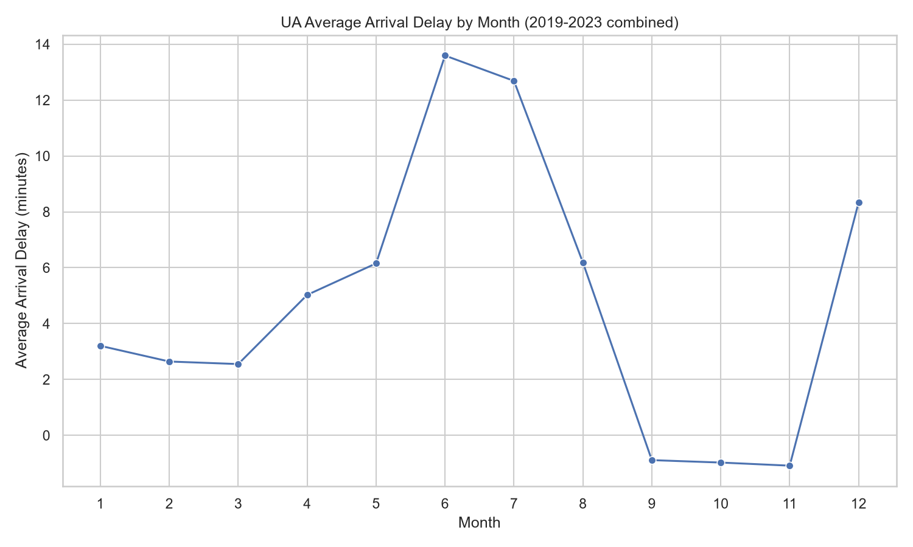
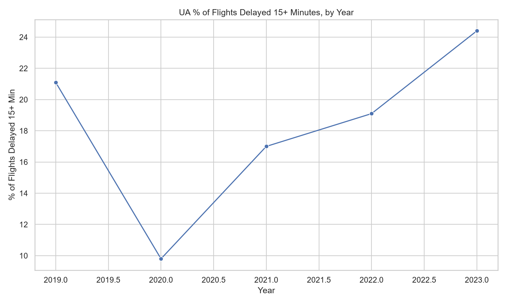

# ✈️ United Airlines Flight Delay & Operational Performance Analysis

A data analytics project investigating flight delays, cancellations, and operational performance for **United Airlines (UA)**, using U.S. Department of Transportation flight data. The project combines SQL, Python, an interactive BI dashboard, and two AI-powered features (a delay-risk predictor and a natural-language data assistant) to turn raw operational data into decisions an airline could actually act on.

Built as a portfolio project for a **Data Analyst** role at United Airlines.

---

## 1. Why This Project

Flight delays are one of the most expensive and reputation-damaging problems an airline faces — they drive crew/aircraft rescheduling costs, missed connections, compensation payouts, and customer churn. As a Data Analyst at United, the job isn't just to report "flights were late" — it's to explain **why**, **where**, **when**, and **what to do about it**.

This project treats that as a real business problem:

> *"Where is United losing the most operational time to delays, what's driving it, and what would you recommend to reduce it?"*

---

## 2. Business Questions Answered

1. Which airports, routes, and months have United's worst on-time performance?
2. What's actually causing the delays — weather, carrier issues, air traffic (NAS), late-arriving aircraft, or security?
3. Is UA's on-time performance improving or worsening over time?
4. Which delay cause costs the most in total minutes/frequency, and is it something UA can control (e.g., late-aircraft turnaround) vs. something it can't (e.g., weather)?
5. **(AI) Can we predict, before a flight departs, its risk of a significant delay?**
6. **(AI) Can a non-technical stakeholder ask questions about the data in plain English and get an answer instantly?**

---

## 3. Data Source

**U.S. DOT / Bureau of Transportation Statistics (BTS) — Airline On-Time Performance Data**
- Source: [BTS TranStats Reporting Carrier On-Time Performance](https://www.transtats.bts.gov/DL_SelectFields.aspx?gnoyr_VQ=FGJ)
- Alternative (easier download): [Kaggle — 2015–2019 Airline Delay and Cancellation Data](https://www.kaggle.com/datasets/usdot/flight-delays) or newer BTS extracts on Kaggle
- Filter applied: `OP_UNIQUE_CARRIER == "UA"`
- Fields used: flight date, origin/destination airport, scheduled vs. actual departure/arrival time, delay minutes by cause (carrier, weather, NAS, security, late aircraft), cancellation code, distance, air time

> Raw data isn't committed to this repo (BTS monthly files are large). See [`/data/README.md`](data/README.md) for the exact download-and-filter steps to reproduce the dataset locally.

---

## 4. Tools & Tech Stack

| Purpose | Tool |
|---|---|
| Data cleaning & exploratory analysis | Python (pandas, NumPy, matplotlib/seaborn) |
| Structured querying / aggregation | SQL (PostgreSQL or SQLite) |
| Interactive dashboard | Power BI (or Tableau) |
| Delay-risk prediction (AI) | Python, scikit-learn (classification model) |
| Natural-language data assistant (AI) | Python + LLM API (e.g., OpenAI/Claude) via a simple RAG / text-to-SQL layer, or LangChain |
| Version control | Git & GitHub |

---

## 5. Project Structure

```
United-Airlines-Data-analysis/
├── data/
│   └── README.md              # how to download & filter the raw BTS data
├── notebooks/
│   ├── 01_data_cleaning.ipynb
│   ├── 02_exploratory_analysis.ipynb
│   └── 03_delay_prediction_model.ipynb
├── sql/
│   └── queries.sql            # key business-question queries
├── dashboard/
│   ├── united_delays.pbix     # Power BI file (or Tableau .twbx)
│   └── screenshots/
├── ai_assistant/
│   └── query_assistant.py     # natural-language → data-answer tool
├── README.md
└── requirements.txt
```

---

## 6. Methodology

1. **Data cleaning** — handle missing values, standardize timestamps, filter to United Airlines only, remove/flag cancelled vs. diverted flights.
2. **Exploratory analysis** — delay distributions by airport, route, day of week, month, and time of day; breakdown of delay minutes by cause.
3. **SQL layer** — key aggregations (e.g., top 10 worst airports by average delay, monthly trend, cause-by-route breakdown) written as reusable, documented queries.
4. **Dashboard** — an interactive Power BI report so a non-technical stakeholder can filter by airport/month/cause and see the story visually.
5. **AI Feature 1 — Delay Risk Predictor**: a classification model (e.g., logistic regression / random forest / XGBoost) that predicts the probability a flight will be delayed >15 minutes, using route, airport, month, day of week, and time of day as features. Includes a feature-importance chart so the "why" behind predictions is explainable, not a black box.
6. **AI Feature 2 — Natural-Language Data Assistant**: a small script/notebook where a user can type a question like *"What's UA's worst month for delays at ORD?"* and get an answer generated from the actual dataset (via a text-to-SQL or RAG approach over the cleaned data) — demonstrating applied LLM skills on top of traditional analytics.

---

## 7. Key Findings

*(Based on 254,504 United Airlines flights, 2019–2023, from the BTS/Kaggle sample dataset.)*

1. **Late-aircraft delays are UA's #1 problem, not weather.** Of all attributed delay-minutes, **40.6% come from late-aircraft delays** (a plane arriving late and pushing back its next flight), **30.0% from carrier-caused delays** (crew, maintenance, cleaning), **24.2% from NAS/air-traffic-control issues**, and only **5.2% from weather**. → *So what: the majority of UA's delay minutes are operationally controllable (aircraft turnaround + carrier ops), not acts of nature — meaning better scheduling buffers and turnaround management would have real, measurable impact.* 

2. **A handful of airports drag down the average.** SRQ (Sarasota), CLT (Charlotte), SAV (Savannah), and ANC (Anchorage) have the worst average arrival delays among airports with 200+ UA flights — SRQ averages nearly **17 minutes late**, more than double UA's system-wide average. → *So what: these routes/stations are strong candidates for a targeted operational review (ground handling, connection buffers) rather than a system-wide fix.* 

3. **Summer is UA's worst season.** June and July average **13.6 and 12.7 minutes of arrival delay** respectively — more than 4x the delay seen in September–November, which actually run *early* on average. December (holiday travel) is the next-worst month at 8.3 minutes. → *So what: peak summer travel demand combined with weather/ATC congestion compounds delays — this is when schedule padding matters most.* 

4. **On-time performance dipped in 2020 (fewer flights, less congestion) then worsened again by 2023.** The share of flights delayed 15+ minutes was 21.1% in 2019, dropped to 9.8% in 2020 (pandemic low-traffic year), then climbed back up to **24.4% in 2023** — the worst year in the dataset. → *So what: post-pandemic recovery brought traffic (and delays) back higher than pre-pandemic levels, suggesting current scheduling hasn't caught up with demand.* 

5. **Cancellations are relatively rare but not negligible.** UA's overall cancellation rate in this sample is **2.18%** — worth tracking alongside delays since cancellations impose a much higher cost per event (rebooking, compensation) than a short delay.

*(Charts generated by [`notebooks/02_exploratory_analysis.py`](notebooks/02_exploratory_analysis.py); regenerate anytime by re-running that script.)*

**Bonus (from SQL analysis, [`sql/queries.sql`](sql/queries.sql)):**
- Worst single route by delay: **EWR → MCI averages 35.8 minutes** late (106 flights) — the worst of any route with 100+ flights.
- Highest cancellation-rate airports: **ORF (4.22%)**, BUF (4.21%), and ROC (4.15%) — notably, ROC also appears in the worst-delay airport list, suggesting a station-level issue worth investigating specifically.

---

## 8. Recommendations

- **Prioritize aircraft turnaround over weather mitigation.** Since late-aircraft and carrier-caused delays together account for ~71% of delay-minutes (vs. 5% for weather), operational investment (turnaround time, crew scheduling, maintenance buffers) will move the needle far more than anything weather-related.
- **Add schedule buffer in June–July and December.** These months consistently run 8–14 minutes late on average vs. near-zero or negative (early) in fall months — a targeted few minutes of padding on summer/holiday schedules at the worst-affected airports (SRQ, CLT, ANC) would reduce cascading late-aircraft delays downstream.
- **Run a station-level operational review at the worst airports.** SRQ, CLT, SAV, ANC, and MSO are consistent outliers — worth investigating ground operations, gate availability, and connection scheduling at these specific stations rather than a system-wide policy change.
- **Track the 2023 regression.** On-time performance in 2023 (24.4% of flights delayed 15+ min) is worse than pre-pandemic 2019 (21.1%) — recommend a monthly-refreshed dashboard (see Section 9) to monitor whether recent operational or scheduling changes are helping or hurting.

---

## 9. Dashboard Preview

*(Add screenshots or a link here once built.)*

```
dashboard/screenshots/overview.png
dashboard/screenshots/delay_causes.png
dashboard/screenshots/route_map.png
```

---

## 10. How to Reproduce

```bash
# 1. Clone the repo
git clone https://github.com/<your-username>/United-Airlines-Data-analysis.git
cd United-Airlines-Data-analysis

# 2. Install dependencies
pip install -r requirements.txt

# 3. Download & filter data (see data/README.md for source links)
#    Place the filtered UA-only CSV in /data

# 4. Run notebooks in order
jupyter notebook notebooks/01_data_cleaning.ipynb

# 5. (Optional) Run the AI assistant
python ai_assistant/query_assistant.py
```

---

## 11. Why This Matters for United Airlines

This project mirrors the kind of work a Data Analyst does on United's Network Planning, Operations, or Customer Experience teams: turning raw operational data into airport- and route-level insight, quantifying the cost of controllable vs. uncontrollable delays, and presenting findings in a way both technical and non-technical stakeholders can act on — plus a demonstrated ability to apply modern AI tooling (predictive modeling, LLM-based data access) on top of traditional analytics, not just build static reports.

---

## 12. About Me

**[Your Name]**
Aspiring Data Analyst | Python · SQL · Power BI · Applied AI/ML
📧 sreeharisasikumart@gmail.com
🔗 [LinkedIn] · [Portfolio] · [GitHub]

---

## 13. Next Steps / Roadmap

- [ ] Extend analysis to multi-year trend (pre/post pandemic recovery)
- [ ] Add cancellation-specific analysis
- [ ] Deploy the delay-risk model as a small interactive web app (Streamlit)
- [ ] Expand the AI assistant into a chat-style interface over the full dashboard
